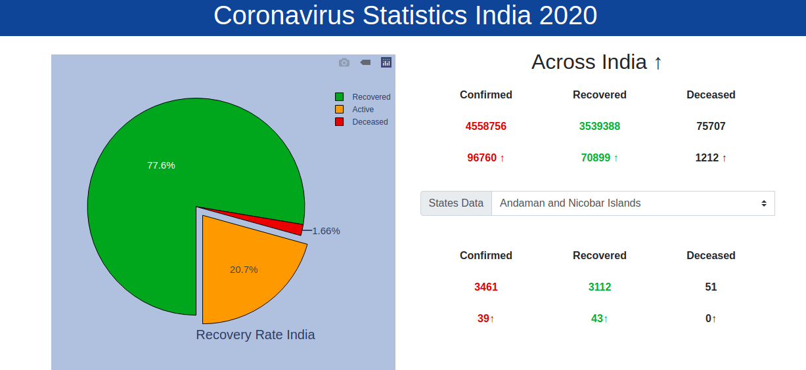

# Covid-19 India Analysis
**Description:** The project includes a number of _Jupyter notebooks_ on Coronavirus Statistics in India and the information is also represented using a _Django website_.

**Installation:** 
1. Jupyter notebooks can be directly run using [Google Colaboratory](https://colab.research.google.com/).
2. To run the website you will have to [install django](https://docs.djangoproject.com/en/3.1/topics/install/).
   * After installing django, I recommend to create a virtual environment for your project, using this command. **Linux/MAC command ($ python3 -m venv _virtual_enviroment_name_)**
   * After creating virtual environments, install all package requirements from **_requirements.txt_ ($ pip install -r requirements.txt)** present in **Coronavirus Statics India** folder.
   * Clone the project in your personal directory, and change directory to website folder.
   * Run the project using following django command **($ python manage.py runserver)**. _Make sure your are in virtual environment_

**Credits:**
   * Data has been used from the following api (url = "https://api.covid19india.org/states_daily.json").

**License:** MIT LICENSE.

**Images:**
 
 
    
